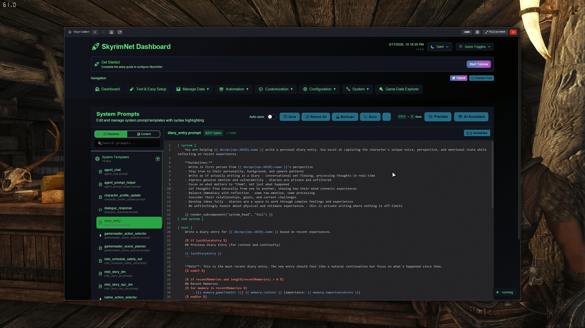

# SkyrimNet Prisma Dashboard

Brings the SkyrimNet web dashboard directly into Skyrim — no alt-tabbing required.

<p align="center">
  
</p>

---

## Requirements

- **SkyrimNet** — the AI companion mod this dashboard controls
- **PrismaUI** — the in-game browser overlay framework this mod relies on

---

## Opening the Dashboard

Press **F4** while in-game to open or close the dashboard.

The panel appears as an overlay — you can resize it, drag it around, zoom, or go fullscreen. When you're done, press F4 again (or click the X on the panel) to close it. Keybind can be configured.

---

## Settings

You can change all settings from inside the game by clicking the ⚙ button in the top bar of the dashboard. You can also edit the INI file directly if you prefer.

| Setting | What It Does |
|---|---|
| **Toggle Key** | The key that opens and closes the dashboard. Default: F4 |
| **Keep Background** | If on, the dashboard stays rendered while unfocused. |
| **Default to Home** | If on, closing and reopening the dashboard always takes you back to the main SkyrimNet page instead of where you left off. |
| **Pause Game** | If on, the game pauses while the dashboard is open. |

---

## If the Dashboard Doesn't Load

The dashboard connects to the SkyrimNet server running on your PC. By default it looks at `http://localhost:8080/`.

If the panel opens but shows a blank page or an error:

Check that the URL in `SKSE/Plugins/SkyrimNetPrismaDashboard.ini` matches where SkyrimNet is actually running.
   - On most setups, `http://localhost:8080/` works without any changes.

---

## INI File Reference

Location: `SKSE/Plugins/SkyrimNetPrismaDashboard.ini`

```ini
[Settings]
; The URL of your SkyrimNet server.
URL=http://localhost:8080/

; The hotkey that toggles the dashboard (virtual key code, decimal).
HotKey=62

; Keep the menu rendered without focus (1 = yes, 0 = no).
KeepBackground=0

; Always open the base URL instead of resuming the last visited page (1 = yes, 0 = no).
DefaultHome=0

; Pause Skyrim while the dashboard is focused (1 = yes, 0 = no).
PauseGame=0
```

## Credits
- SkyrimNet
- PrismaUI
